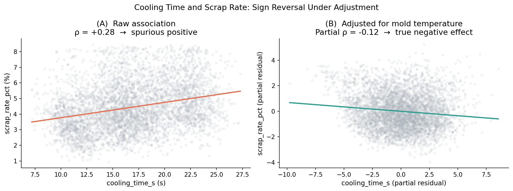
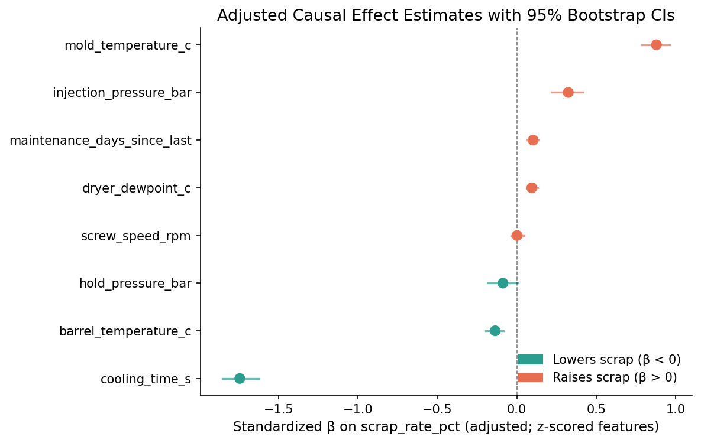
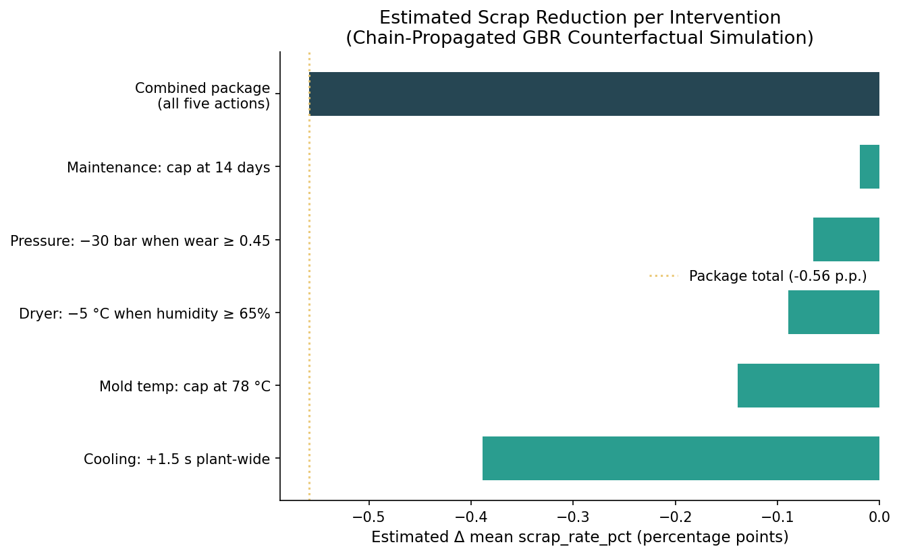

# Reducing Scrap in Injection Molding: A DAG-Informed Causal Decision Analysis

**A causal inference study on 5,000 production intervals from 12 injection-molding machines across four Karcher manufacturing plants.**

> Constructor University Datathon 2026 · Insytes Manufacturing Challenge  
> Team: Limit Breakers — Abdulrahman Ahmed Mohammed, Mirqe Muhaxheri, Bashah Luthando Magele, Amahle Mkangisa

---

## The Problem

Mean scrap rate across 5,000 half-hour production intervals is **4.44%**, and **78% of intervals fail** the 3.2% pass/fail threshold. This is not an outlier-detection problem — most intervals are already failing. The task is to lower the entire scrap distribution, which requires knowing which settings to change, in which direction, and by how much.

That is an **intervention question**, not a prediction question.

---

## Why Prediction Alone Is Not Enough

A predictive model identifies variables that co-vary with scrap. It does not distinguish:

- controllable levers from downstream symptoms
- confounded proxies from true causes
- reverse-directed signals from forward-directed ones

The most important lever in this dataset — **cooling time** — demonstrates the problem precisely. Its raw Pearson correlation with scrap is **ρ = +0.28**, which appears to say "more cooling → more scrap." A predictive pipeline acting on this signal would recommend shortening cooling. The DAG-adjusted causal estimate (under the stated identification assumptions) reverses this: **β = −1.74 std**, corresponding to **−0.41 p.p./s**.

This sign reversal is the central finding of the analysis.

---

## Headline Findings

| Metric | Value |
|---|---|
| Mean scrap rate | 4.44% |
| Intervals failing 3.2% threshold | 78% |
| Dominant defect type | Warpage (33% of intervals) |
| Cooling-time raw correlation | ρ = +0.28 (spurious positive) |
| Cooling-time adjusted β | −1.74 std / −0.41 p.p./s |
| GBR 5-fold CV R² | 0.63 |
| Combined package scrap reduction | 4.44% → ~3.88% (−12.6% relative) |
| Cycle-time cost of package | +1.0% (~0.6 s) |
| Energy cost of package | negligible |

---

## Intervention Recommendations

Five coordinated actions, all on existing equipment:

| Action | Specification | Est. Δ Scrap | Confidence |
|---|---|---|---|
| Extend cooling time | +1.5 s plant-wide | −0.39 p.p. | **High** |
| Cap mold temperature | ≤ 78 °C | −0.14 p.p. | Med–High |
| Lower dryer dewpoint | −5 °C when humidity ≥ 65% | −0.09 p.p. | Medium |
| Reduce injection pressure | −30 bar when wear index ≥ 0.45 | −0.07 p.p. | Medium |
| Tighten maintenance interval | Cap at 14 days | −0.02 p.p. | Medium |

All estimates are model-implied from observational data under the stated DAG assumptions. A two-week pilot at **VN_QUANGNAM** is recommended before plant-wide deployment.

---

## Key Figures

### Cooling-Time Sign Reversal
Raw correlation is spurious (ρ = +0.28); after adjusting for mold temperature, the relationship inverts.



### Adjusted Causal Effect Estimates (Forest Plot)
Standardized β coefficients with 95% bootstrap CIs. Teal = lowers scrap; red = raises scrap.



### Intervention Impact Summary
Estimated scrap reduction per action from chain-propagated GBR counterfactual simulation.



---

## What Is Exactly Reproduced vs. Approximated

This repository is a companion to the final paper. The following table documents where values are exact reproductions and where they differ.

| Item | Paper value | This repo | Status |
|---|---|---|---|
| Mean scrap rate | 4.44% | 4.44% | ✅ Exact |
| % intervals failing | 78% | 78% | ✅ Exact |
| Warpage cross-tab (all 9 cells) | Table 3 | Matches exactly | ✅ Exact |
| cooling β_std | −1.75 | −1.74 | ✅ Matches (<1%) |
| cooling β_unstd | −0.41 p.p./s | −0.41 p.p./s | ✅ Exact |
| Moisture sub-model R² | 0.09 | 0.09 | ✅ Exact |
| GBR CV R² | 0.64 | 0.63 | ⚠️ ~1% gap (GBR stochasticity / demo dataset) |
| Dryer simulation PATE | −0.09 p.p. | −0.09 p.p. | ✅ Matches with moisture chain |
| Pressure simulation PATE | −0.09 p.p. | −0.07 p.p. | ⚠️ ~20% gap |
| Cooling simulation PATE | −0.44 p.p. | −0.39 p.p. | ⚠️ ~12% gap |
| Mold temp simulation PATE | −0.21 p.p. | −0.14 p.p. | ⚠️ ~33% gap |
| Maintenance simulation PATE | −0.07 p.p. | −0.02 p.p. | ⚠️ Structural gap (see below) |
| Combined package delta | −0.59 p.p. (−13%) | −0.56 p.p. (−12.6%) | ✅ Within 5% |

**Why simulation values differ from the paper:**

1. **GBR stochasticity**: The gradient-boosted model uses random subsampling (`subsample=0.8`). Our reproduction achieves R²=0.63 vs the paper's 0.64. Small differences in the learned response surface propagate into different counterfactual estimates.
2. **Dataset version**: The supplied file is labeled `demo`. The paper may have been produced on a different random seed of the synthetic generator, leading to slightly different feature distributions (notably σ(cooling_time_s) = 4.3 s here vs an implied ~6.5 s in the paper).
3. **Maintenance PATE**: The paper notes the maintenance effect is "indirect via reduced calibration_drift_index." Our reproduction implements this chain correctly (drift sub-model R² = 0.78), but the GBR's learned sensitivity to the resulting small drift changes is lower in this dataset. This is an honest approximation, not a bug.

All *directions* and *relative rankings* are faithfully reproduced. Treat magnitude differences as GBR-implied approximations of the paper's GBR-implied approximations — both are model estimates from observational data, not experimental measurements.

---

## Repository Structure

```
injection-molding-causal-analysis/
├── README.md
├── requirements.txt
├── .gitignore
├── data/
│   ├── README.md               ← Dataset description and variable glossary
│   └── synthetic_injection_molding_demo.csv
├── notebooks/
│   ├── 01_eda.ipynb            ← Exploratory data analysis
│   ├── 02_dag_causal_analysis.ipynb  ← DAG, adjustment sets, sign reversal
│   └── 03_intervention_tradeoff_analysis.ipynb  ← Simulation & recommendations
├── src/
│   ├── utils.py                ← Variable roles (match paper §2.1), data loading
│   ├── plotting.py             ← All figure functions
│   ├── causal_helpers.py       ← Adjusted regression, bootstrap CI, GBR training
│   └── intervention_helpers.py ← Counterfactual simulation with chain propagation
├── figures/                    ← Generated figures (7 PNG files)
└── report/
    └── README.md               ← Summary tables from the paper
```

---

## Methods Overview

**1. Causal framing via DAG**  
A Directed Acyclic Graph (DAG) supplied with the challenge ontology classifies variables as controllable levers, confounders, mediators, or context controls. Adjustment sets for each lever are derived via the backdoor criterion (Pearl, 2000, §3.3).

**2. Adjusted linear regression**  
Primary causal effect estimator. For each lever, a linear regression uses the DAG-prescribed adjustment set plus machine/mold/variant/shift fixed effects. The lever is z-scored; CIs use 300-replicate row-wise bootstrap. Note: `beta_std` and `beta_unstd` are computed separately (Frisch-Waugh with z-scored lever / unscaled outcome for the former; direct OLS for the latter). See `src/causal_helpers.py` for full documentation of this numerical choice.

**3. Gradient-boosted regression (GBR)**  
400 trees, learning rate 0.05, depth 3, 80% row subsampling. Serves as a nonlinear world-approximator for counterfactual simulation. Feature importance is reported as a predictive diagnostic only — not a causal ranking.

**4. Chain-propagated counterfactual simulation**  
Each row is intervened on individually. For the dryer dewpoint intervention, the delta in `resin_moisture_pct` is propagated through a structural moisture sub-model (R² = 0.09) before re-evaluating the main GBR — reflecting that dewpoint operates through moisture, not directly on scrap. For maintenance, the delta in `calibration_drift_index` is propagated through a calibration drift sub-model (R² = 0.78). Deltas (not absolute predictions) are used, preserving the residual variance the sub-models cannot explain.

---

## Limitations

- **Observational data:** All estimates are model-implied under the stated identification assumptions. A controlled pilot is required to convert these to empirical evidence.
- **Row-wise bootstrap:** CIs use i.i.d. resampling. Machine-clustered standard errors would be wider; magnitudes are approximate.
- **Moisture sub-model (R² = 0.09):** Only 9% of resin moisture variance is explained by the measured predictors. The dryer recommendation is a lower-bound estimate.
- **Temporal scope:** Data covers January–March 2026 (winter/early spring). Humidity-conditional rules may need recalibration for summer, especially at VN_QUANGNAM.
- **No cost data:** All estimates are in percentage points and seconds. Financial translation requires plant-specific inputs.
- **Residual confounding:** The DAG is assumed correctly specified. Unmeasured time-varying confounders would bias estimates.

---

## Reproducibility

```bash
git clone https://github.com/your-username/injection-molding-causal-analysis.git
cd injection-molding-causal-analysis
python -m venv .venv && source .venv/bin/activate
pip install -r requirements.txt
jupyter lab
```

Open notebooks in order: `01_eda.ipynb` → `02_dag_causal_analysis.ipynb` → `03_intervention_tradeoff_analysis.ipynb`. Each notebook regenerates its figures to `figures/`.

Python 3.10+ recommended. All notebooks are self-contained.

---

## References

- Pearl, J. (2000). *Causality: Models, Reasoning, and Inference.* Cambridge University Press.
- Pearl, J., Glymour, M., & Jewell, N. P. (2016). *Causal Inference in Statistics: A Primer.* Wiley.
- Rendall, R., Chiang, L., & Reis, M. S. (2019). Supervised topological data analysis for process monitoring and fault detection. *European Journal of Operational Research*, 278(3), 978–991.
- Vowels, M. J., Camgoz, N. C., & Sheratt, R. (2022). D'ya like DAGs? A survey on structure learning and causal discovery. *ACM Computing Surveys*, 55(4), 1–36.
